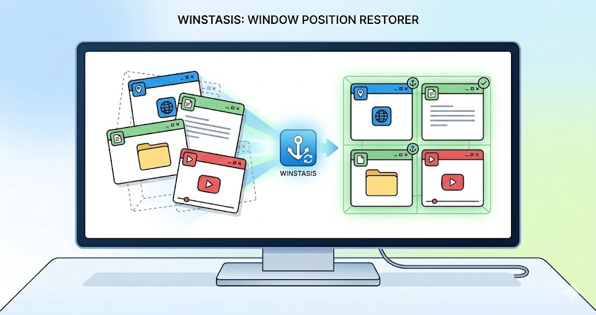

# 🪟 WinStasis

**A lightweight, native C# Window Session Manager built for power users.**



*winst* is a command-line utility designed to capture, save, and seamlessly restore the exact positions, sizes, states, and **Virtual Desktops** of Windows applications. It is built to tame the chaos of multi-workspace reboots and ensure that critical tools—including accessibility overlays and development environments—stay exactly where they belong.


## 🛠️ Usage & Installation

### Requirements
* **For Users**: Windows 10 or 11 (64-bit). No .NET runtime installation is required, as the published release is completely self-contained.
* **For Developers**: [.NET 10.0 SDK](https://dotnet.microsoft.com/download) is required. Dependencies (such as NuGet packages) are defined in the project files and will be automatically restored by the build system.

### Global Installation (Add to PATH)
To use `winst` globally from any terminal, you should publish it as a self-contained executable:
```bash
# Build a standalone .exe
dotnet publish -c Release -r win-x64 --self-contained true -p:PublishSingleFile=true

# The resulting winst.exe will be output to:
# WinStasis\bin\Release\net10.0-windows10.0.19041.0\win-x64\publish\

# Add this folder to your system's %PATH% Environment Variable.
```

### Storage Location
Saved session profiles are securely stored in your local Windows AppData directory:
`%LOCALAPPDATA%\WinStasis\sessions\`

### Commands


```bash
# Save current layout across ALL Virtual Desktops
winst save coding

# Overwrite an existing profile
winst save coding --force

# List all windows in a profile with Target IDs and human-readable Workspaces
winst list coding

# Restore all windows in a profile (Across all Desktops!)
winst restore coding

# Restore a specific window by its Target ID
winst restore coding --target 5
```

> **Note on Elevated Windows:** Windows User Interface Privilege Isolation (UIPI) prevents normal applications from moving windows owned by an Administrator. To restore Admin-level apps (like an elevated PowerShell prompt), you must run `winst` from an Administrator terminal.

## 💾 Profile Storage & Format
Profiles are saved as JSON files inside the standardized Windows Local AppData directory:
`%LOCALAPPDATA%\WinStasis\sessions\`

### Session JSON Example
```json
{
  "ProfileName": "coding",
  "CreatedAt": "2026-05-18T12:00:00",
  "Windows": [
    {
      "TargetId": 1,
      "Hwnd": 0,
      "ProcessName": "WindowsTerminal",
      "WindowTitle": "PowerShell",
      "X": 100,
      "Y": 100,
      "Width": 800,
      "Height": 600,
      "ShowCmd": 1,
      "DesktopId": "cb9b56f8-276a-405f-b560-b4d97c759c98",
      "IsPinned": false
    }
  ]
}
```
*   `ShowCmd`: 1 (Normal), 2 (Minimized), 3 (Maximized).
*   `DesktopId`: The GUID of the Virtual Desktop. `00000000-0000-0000-0000-000000000000` represents the "Global" workspace.
*   `IsPinned`: `true` if the window is pinned globally to appear on all Virtual Desktops simultaneously.

## 🛤️ Future Directions & Offshoots
The core MVP is complete. We are exploring stable offshoots that utilize the robust "Observer" engine we've built here:

*   **[vdtree: Verbose Window Inspector](https://github.com/amirf147/vdtree)**: A read-only CLI tool that provides deep, structured metadata about the Windows desktop layer in a human-readable tree format.
*   **[Caster UIA Context Engine](docs/research_ui_automation_vs_win32.md)**: A micro-service utilizing Microsoft UI Automation (UIA) to track keyboard focus inside specific application panes to trigger ultra fine-grained, context-aware speech grammars for the Caster accessibility toolkit.
*   **Phase 5 (Deferred): Multi-Monitor Topology Mapping & Per-Monitor V2 DPI Scaling:** Deep hardware mapping and [Per-Monitor V2 DPI Virtualization fix](docs/research_dpi_awareness_and_multi_monitor_scaling.md) to perfectly restore coordinates across mixed-DPI displays and docking scenarios.

